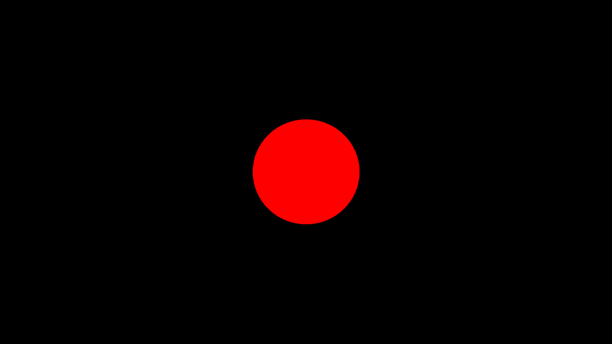

# Rusttracer

YAR(Yet Another Raytracer).

I like to write raytracers to learn new programming languages. They're fun and are a natural way to learn most OOP languages. Naturally I'm writing a raytracer in rust called rusttracer 🙂.. This is largely a port of my SwiftTracer.

## First render

