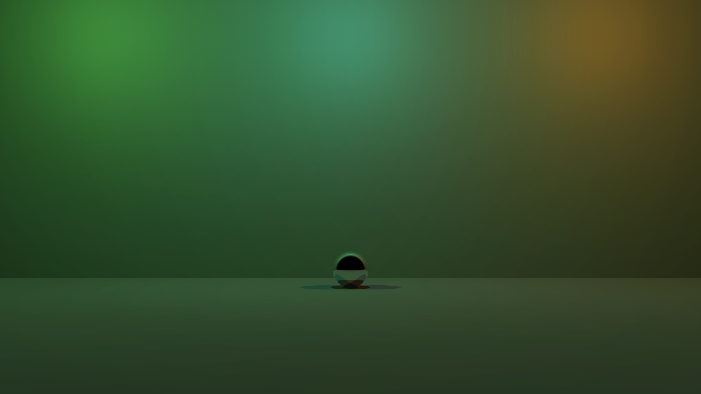
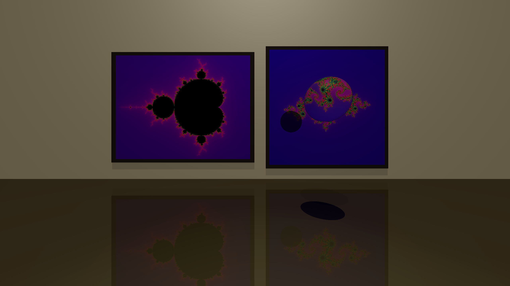

# Rusttracer

YAR(Yet Another Raytracer).

I like to write raytracers to learn new programming languages. They're fun and are a natural way to learn most OOP languages. Naturally I'm writing a raytracer in rust called rusttracer 🙂.

## Building

Make sure you have the rust nightly toolchain installed then run

```bash
cargo build --release
```

## Running

The project uses a json based configuration format. For an example see the [`rgb-spheres.json`](scenes/rgb-spheres.json) scene. To render it run:

```bash
target/release/rusttracer --config-path scenes/rgb-spheres.json
```

## Usage

```bash
Usage: target/release/rusttracer [options]

Options:
    -c, --config-path CONFIG_PATH
                        config file path, uses `default.json` if not specified
    -b, --benchmark     Benchmark by rendering the scene multiple times
    -h, --help          prints this help menu
```

## Renders


> This was the first render produced.



> This was rendered a while later, at this point there was support for diffuse colors, specular highlights, reflection, colored lights, and super sampling. This is 2560x1440 at 4x4 super sampling


> This rendering uses procedural textures to render the fractal artworks. This is 2560x1440 at 4x4 super sampling.

